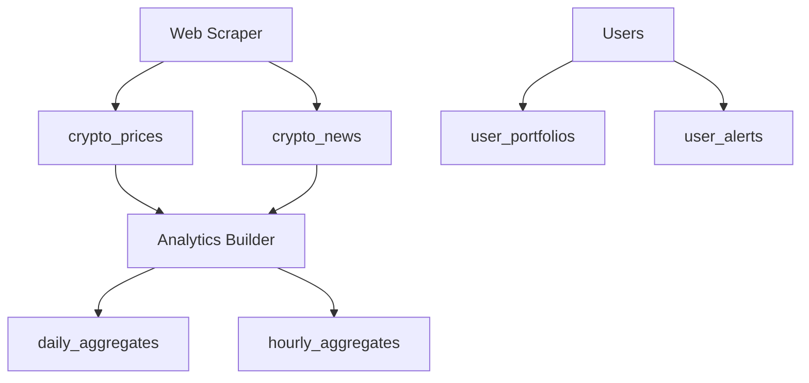

# Database Setup - Crypto Tool

## 🗄️ Supabase Database Configuration

### Quick Setup

1. **Create Supabase Project**
   ```bash
   # Go to https://supabase.com/dashboard
   # Create new project
   # Note your Project URL and API Keys
   ```

2. **Configure Environment**
   ```bash
   cp .env.example .env
   # Fill in your Supabase credentials
   ```

3. **Run Database Setup**
   ```sql
   -- In Supabase SQL Editor, run in order:
   -- 1. schema.sql (creates all tables)
   -- 2. rls-policies.sql (sets up security)
   -- 3. auth-config.sql (configures authentication)
   ```

### 📋 Database Schema

#### Core Tables
- **`cryptocurrencies`** - Crypto asset information
- **`crypto_prices`** - Real-time price data
- **`crypto_news`** - Scraped news articles
- **`daily_aggregates`** - OLAP analytics data
- **`hourly_aggregates`** - Real-time analytics

#### User Tables
- **`user_portfolios`** ✅ - User crypto holdings
- **`user_alerts`** ✅ - Price/news alerts
- **`user_profiles`** - Extended user information

#### System Tables
- **`processing_jobs`** - Background job tracking
- **`api_sources`** - External API management
- **`audit_logs`** - Security audit trail

### 🔒 Security Features

#### Row Level Security (RLS)
- ✅ Users can only access their own data
- ✅ Admins have elevated permissions
- ✅ Service roles for backend operations
- ✅ Anonymous access for public data

#### Authentication
- ✅ Supabase Auth integration
- ✅ User profiles with subscription tiers
- ✅ API rate limiting
- ✅ Session management

### 🚀 Performance Optimizations

#### Indexes
- Crypto prices by timestamp
- News by publication date
- User data by user_id
- RLS-optimized indexes

#### Triggers
- Auto-update timestamps
- User profile creation
- Login tracking

### 📊 Data Flow



### 🔧 Management Commands

#### Setup Database
```sql
-- Run in Supabase SQL Editor
\i schema.sql
\i rls-policies.sql
\i auth-config.sql
```

#### Reset Daily Counters (run daily)
```sql
SELECT public.reset_daily_api_counters();
```

#### Cleanup Old Data (run weekly)
```sql
SELECT public.cleanup_old_audit_logs(90);
SELECT public.cleanup_old_api_requests(30);
SELECT public.cleanup_expired_sessions();
```

### 📈 Monitoring

#### Check System Health
```sql
-- Active users today
SELECT COUNT(*) FROM user_profiles
WHERE last_login_at > CURRENT_DATE;

-- API usage today
SELECT SUM(api_requests_today) FROM user_profiles;

-- Recent processing jobs
SELECT * FROM processing_jobs
WHERE created_at > NOW() - INTERVAL '1 hour'
ORDER BY created_at DESC;
```

#### Performance Metrics
```sql
-- Slow queries
SELECT * FROM pg_stat_statements
WHERE mean_exec_time > 1000
ORDER BY mean_exec_time DESC;

-- Table sizes
SELECT schemaname, tablename,
       pg_size_pretty(pg_total_relation_size(schemaname||'.'||tablename)) as size
FROM pg_tables
WHERE schemaname = 'public'
ORDER BY pg_total_relation_size(schemaname||'.'||tablename) DESC;
```

### 🛠️ Troubleshooting

#### Common Issues

1. **RLS Permission Denied**
   ```sql
   -- Check if user has proper role
   SELECT auth.role();

   -- Verify user ownership
   SELECT user_id FROM user_portfolios WHERE id = 'portfolio-id';
   ```

2. **Rate Limiting**
   ```sql
   -- Check user limits
   SELECT public.get_user_limits(auth.uid());

   -- Reset if needed
   UPDATE user_profiles SET api_requests_today = 0 WHERE id = auth.uid();
   ```

3. **Migration Errors**
   ```sql
   -- Check table dependencies
   SELECT * FROM information_schema.table_constraints
   WHERE constraint_type = 'FOREIGN KEY';
   ```

### 📋 Required Supabase Settings

#### Authentication
- Enable email authentication
- Configure email templates
- Set JWT expiry (24 hours recommended)

#### API Settings
- Enable RLS on all tables
- Set up service role key
- Configure CORS for your domain

#### Extensions Required
- `uuid-ossp` (UUID generation)
- `pg_trgm` (Text search)
- `btree_gin` (Array indexes)